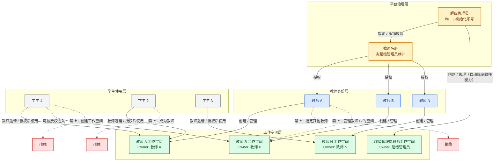

# 教师-学生权限组织架构

这张图描述已确认的目标架构：一个超级管理员可以指定多名教师，并自动继承教师能力创建和管理自己的工作空间；其他教师只能管理自己的工作空间；学生只能被授权进入教师工作空间。

## 读图要点

1. 超级管理员是唯一的平台最高身份，负责维护教师名册，并自动具备教师端能力。
2. 超级管理员可以创建自己的教师工作空间，空间 Owner 是超级管理员本人。
3. 教师数量可以有多个；每位教师可以创建自己的工作空间。
4. 学生只能通过教师授权进入工作空间，不能创建工作空间或成为教师。
5. 教师和超级管理员都只能日常管理自己开设的工作空间；超级管理员对其他教师空间仅保留平台审计/故障恢复边界。
